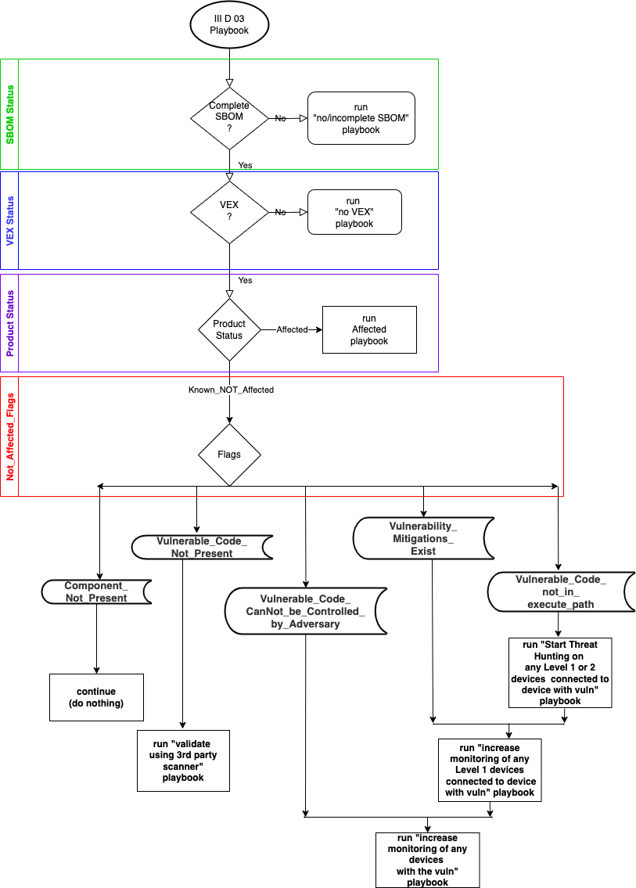

# Frequently Asked Questions

For now this is md. Intent will be to move into codebase
as part of Ogre instantiations.

## What is schedule for this project?
Initial effort is focused on a plugfest/hackathon
planned as part of the
[Cybersecurity Automation Workshop](needlink)
just prior to
[RSAC](https://www.rsaconference.com/usa)
so results can be used at the
[Supply Chain Sandbox](https://supplychainsandbox.org/)
portion of RSAC as part of
[QuadBlockQuiz](https://supplychainsandbox.org/quadblocks).

## What is relation of Ogres to PACE?
Ogres is for instantiating "P1"
in the following PACE architecture picture:

It will be used to evaluate different
PAR implementations (eg using a graph database,
which type of graph database, etc)
including differing
schemes and schemas.
It can be used for storing:
- SBOM data
- VEX data
- vulnerability data
- other ancillary data

In addition various ways to find and collect SBOMS/...
can be evaluated such as from:
- public URL's
- MUD
- OpenC2
- STIX
- private API's (eg behind authentication and/or using "shifters/lycans")

Ogres will also be used as a PES to study
evaluation algorithms and implementations.

## What is relation of Ogres to SBOM?
blah blah blah

## What is relation of Ogres to OpenC2?
All command and control over PACE integration bus
may be performed (i.e. not precluding other methods)
using OpenC2 commands.

More on OpenC2 can be found
[here](https://openc2.org/).

One objective of the Ogres work is to assist in the development
of the necessary OpenC2 commands to meet the usecases desired.

The Ogres codebase includes an OpenC2 API.

blah blah blah

## What are use cases for Ogres?
- PACE-centric uses cases:
   - https://github.com/opencybersecurityalliance/PACE/blob/main/docs/Pace_Sbom_Vex_Flags_Prioritization/README.md
   - add
- OpenC2-centric use cases:
   - https://github.com/oasis-tcs/openc2-usecases/tree/main/PlugFests/2022-06-RSAC
   - add
- CACAO-centric use cases:
   - add
- SBOM-centric use cases:
   - add

## Where can I find SBOMs to use as data for Ogres?
The [Ogres Sbom Examples Repo](https://github.com/sparrell/Oser) (OSER) repo
contains a collection of SBOMs that can be used as sample data.

The Oser module in Ogres can initialize the various Ogres databases
with data from Oser for the purpose of evaluation alternatives.

## What is relation of Ogres to Oser?
The [Ogres Sbom Examples Repo](https://github.com/sparrell/Oser) (OSER) repo
contains a collection of SBOMs that can be used as sample data.

The Oser module in
[Foad](https://github.com/sparrell/Foad)
can initialize the various Ogres databases
with data from Oser for the purpose of evaluation alternatives.

## What is relation of Ogres to CACAO?
Ogres is just a PACE implementation,
and as such, just another security device
to be included in CACAO playbooks.

See {fill in from Pace usecases} for example
CACAO playbooks that make use of PACE.
See {fill in from FOAD} for sample implementations
of some of those playbooks for evaluation purposes.

For example, the {fill in} CACAO playbook is
the {which part - color it?} segment
of the scenario:

And {fill in from Foad} is a sample implementation of that playbook.

Editor's note: Ideally color code sections of scenario showing several
CACAO playbooks and sample implementations.

Editor's note: Ideally have sample implementations from several
projects/vendors - both commercial and open source.

## What is the relation of Ogres to Foad?
The [Fake Orchestrator, Actuators, Decision-makers](https://github.com/sparrell/Foad)
(FOAD) repo contains software to simulate
the orchestrators that direct Ogres
and the devices that Ogres is collection/storing/evaluating the
posture attributes of.

## What can I use to evaluate Ogres architecture/schema alternatives?
The [Ogres Sbom Examples Repo](https://github.com/sparrell/Oser) (OSER) repo
contains a collection of SBOMs that can be used as sample data.
The Oser module in
[Foad](https://github.com/sparrell/Foad)
can initialize the various Ogres databases
with data from Oser for the purpose of evaluation alternatives.

## Can Ogres/Oser/Foad be used to develop playbooks?
sort of blah blah
can be used to help understand the security policies
in light of different situations and postures.
The examples can be tailored by the user
both to help develop their polices and to inform their CACAO
playbook creation.

These systems do not actually create playbooks, nor do they
parse CACAO playbooks.
The examples in Foad are "hard coded" for the purpose of
evaluating Ogres -
i.e. if you change the CACAO playbook, you need to change the
Foad software accordingly.
Actual SOAR systems (ie without the "F" for "fake" of FOAD)
would parse the CACAO playbooks and act accordingly.
