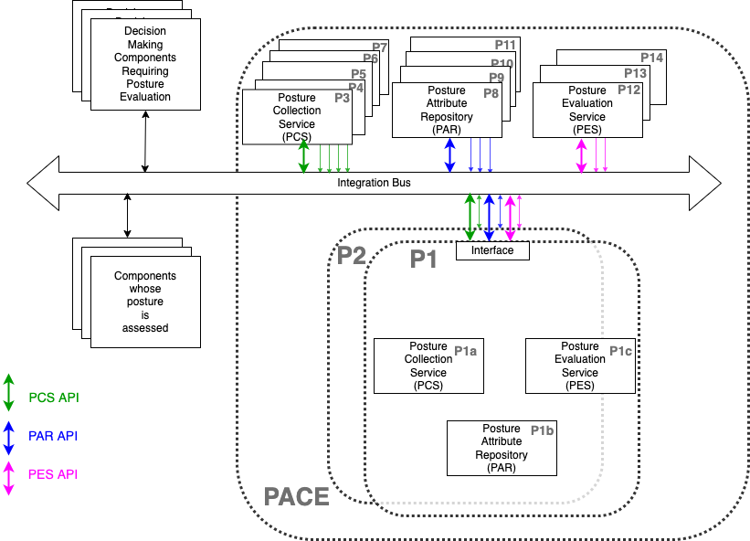

# Ogres
Open Graph Repository in Elixir for Sboms (OGRES)

This repo is for the study of using
Graph databases for storing
Software Bill of Materials (SBOM).

In particular, it is for
[PACE](https://github.com/opencybersecurityalliance/PACE)
and the study of using graph databases for the storage
and evaluation of
[Software Bill of Materials](https://www.cisa.gov/sbom)
(SBOM).
Some example use cases can be found
[here](https://github.com/opencybersecurityalliance/PACE/blob/main/docs/Pace_Sbom_Vex_Flags_Prioritization/README.md).

One direction of study is which type of graph database
(LPG, RDF,...) is best, so many types will be incorporated.
The base software to interface and compare these database types
is from the book

Editor's note - awaiting permission of author/publisher to include.

Ogres is for instantiating "P1"
in the following PACE architecture picture:

Ogre will be instantiated on a cloud server with an
[OpenC2](https://openc2.org/) interface for the red/blue/violet
PACE interfaces in the above architecture.
At least initially, Ogres will be a 'monolithic' PACE.
Whether to break it into separate PCS/PAR/PES is for further study.

The intent for the CAW in June would be for one or more Ogres
instantiations to interact with
- other PACE systems
- "decision making" systems (per [IACD](https://www.iacdautomate.org/) paradigm). Ie the systems following the CACAO playbooks and sending the OpenC2 commands e.g. OIF-Orcestrator by HII.
- the components whose "posture attributes" is being collected, stored, and evaluated (e.g. blinky, twinkly, yuuki, OIF-device, ...)

See [FAQ](./FAQ.md) for more info about Ogres.
BTW the reason for putting in FAQ (instead of here in README)
is because the FAQ is part of the codebase and will appear
on Ogre website.
